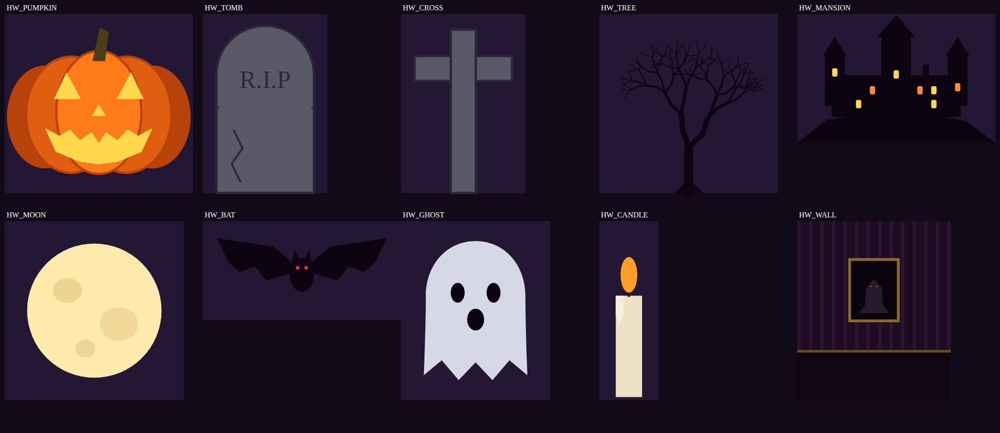
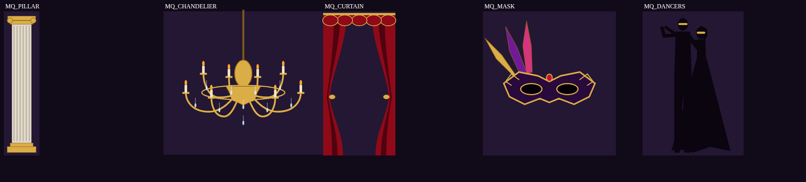

# 歌ってみたMV 制作キット（After Effects）

3Dカメラが歌詞から歌詞へ飛び回る、「MVっぽい」歌詞モーションを **スクリプト一発で組み立てる** ためのキットです。

```
scripts/MV_LyricBuilder.jsx   … 歌詞MVを一発生成（AEで実行）
scripts/MV_Camera3DToolkit.jsx… 3Dカメラ／立ち絵／3D空間のツールパネル（ドッキング可）
scripts/MV_MotionTools.jsx    … イージング／レイヤー整理／ビート検出／ビートFXのツールパネル
scripts/MV_TachieRig.jsx      … 立ち絵にボーンを入れて動かすリグツール（IK・揺れもの・口パク・まばたき）
scripts/MV_Stage3D.jsx        … 3D空間ジェネレーター（トンネル・都市・ステージ・雲海・パーティクル・パノラマ）
samples/sample.lrc            … 歌詞ファイルの書き方サンプル
expressions/MV_Expressions.md … 手で足す用のエクスプレッション集
```

## できること

- 歌詞を1行ずつ **3D空間に配置**（1文字ずつ3Dで飛んできて、ブラーしながら去っていく）
- **3Dカメラリグ** が歌詞のタイミングで次の歌詞へ移動（イージング／手ブレ／ゆらぎ付き）
- カメラワーク 4種：ジグザグ／スパイラル／ダイブ／ターン（90°曲がり角）
- 文字の出方 3種：奥から飛来／上から回転して落下／ブラーズーム
- `!` を付けた行は **強調行**（大きめ・アクセント色・ビートで脈動）
- 浮遊パーティクル＋被写界深度（ボケ）、グロー、グレイン、ビネット、シネマ帯
- 冒頭に曲名・歌い手のタイトル表示
- **`MV_CONTROL` ヌル** のスライダーで全体の動きを後からまとめて調整
- 音に合わせてカメラがパンチイン＆グローが光る **ビート連動**

## 使い方

### 1. 歌詞を用意する（どちらか）

**A. LRCファイル（おすすめ）** — `samples/sample.lrc` を参考に UTF-8 で保存。

```
[ti:曲名]
[ar:歌い手名]
[00:04.00]夜を越えて 走り出した
[00:10.80]名前のない / 光を追いかけて     ← "/" で改行
[00:14.60]-                               ← "-" だけの行 = そこで歌詞を消す（間奏など）
[00:16.00]!届け 届け このメロディ          ← 先頭 "!" = 強調行（サビなど）
```

- 各行は **次のタイムタグまで** 表示されます。
- 歌詞の打ち込みは、LRC作成ツールや歌詞同期アプリで作っておくと楽です。

**B. AEのマーカーで打つ**

1. AEで音源をコンポに置いて選択
2. 再生しながら、歌詞が変わるタイミングでテンキーの `*` を押してマーカーを打つ
3. 歌詞は `歌詞.txt`（1行 = 1マーカー）で渡すか、マーカーのコメントに直接書く
   - コメントがあるマーカーはコメントが優先。コメント `-` は「歌詞を消す」
4. **その音源レイヤーを1つだけ選択した状態で** スクリプトを実行し、「マーカーから作る」を選ぶ

### 2. スクリプトを実行

AE の **ファイル → スクリプト → スクリプトファイルを実行...** で `scripts/MV_LyricBuilder.jsx` を選択。

> 毎回使うなら `After Effects/Scripts/` フォルダにコピーすると「ファイル → スクリプト」のメニューに出ます。

ダイアログで設定して「MVを生成」を押すと、新しいコンポ（既定名 `MV_Lyrics`）が開きます。
設定は次回のために記憶されます。

| 項目 | 説明 |
|---|---|
| フォント(PostScript名) | 例: `YuGothic-Bold`（Win） / `HiraginoSans-W7`（Mac） / `KozGoPr6N-Bold`。フォント名が違うと既定フォントになります |
| アクセント色 | `!` 強調行と、文字が出てくる瞬間のフラッシュ色 |
| 歌詞の間隔 | 歌詞同士の奥行き方向の距離。大きいほどカメラが長く飛ぶ |
| 移動時間 | 次の歌詞へ移動する時間（行の間隔が短いときは自動で短縮） |
| 自動改行 | この文字数を超える行を真ん中あたりで2行に（0で無効） |
| シード | 配置のランダム値。数字を変えると別パターンになる |

### 3. MV_CONTROL で調整

生成されたコンポの一番上にある **`MV_CONTROL`** レイヤーのエフェクトを触ると、全歌詞・カメラにまとめて反映されます。

| エフェクト | 既定 | 意味 |
|---|---|---|
| IN Duration | 0.7 | 1文字が出てくるのにかかる秒数 |
| IN Stagger | 0.045 | 文字ごとの出現のずれ（秒） |
| OUT Duration | 0.45 | 1文字が消えるのにかかる秒数 |
| OUT Stagger | 0.02 | 文字ごとの消えるずれ（秒） |
| Max Spread | 0.9 | 長い行でも出現/消失のずれの合計がこれ以上にならない（秒） |
| Text Push %/s | 2.5 | 歌詞が表示中にじわっと大きくなる量（1秒あたり%） |
| Shake Amount / Freq | 5 / 1.2 | カメラの手ブレ（px / 1秒あたり回数） |
| Sway | 2.5 | カメラのゆらゆら回転（度） |
| Beat Layer | なし | ビート連動に使う「オーディオ振幅」レイヤーを選ぶ |
| Beat Threshold / Max | 5 / 30 | 振幅のこの範囲を 0〜1 のビート強さに変換 |
| Beat Punch | 150 | ビートでカメラが前に出る量（px） |
| Beat Glow | 1.2 | ビートでグローが強くなる量 |
| Emphasis Beat % | 6 | `!` 強調行がビートで脈動する量 |

### ビート連動のやり方

1. `AUDIO` レイヤーを右クリック → **キーフレーム補助 → オーディオをキーフレームに変換**
2. できた「オーディオ振幅」レイヤーを、`MV_CONTROL` の **Beat Layer** で選ぶ
3. 効きが強すぎ/弱すぎなら **Beat Threshold / Beat Max** を調整
   （「オーディオ振幅」の「両チャンネル」の値を見て、キックが鳴る時の値を Max に）

## 生成されるレイヤー構成

```
MV_CONTROL        … 調整用ヌル（エクスプレッションの参照元。名前を変えないでください）
LETTERBOX_*       … シネマ帯（オプション）
VIGNETTE          … 周辺減光
FX_GRADE          … 調整レイヤー（グロー＋ノイズ）
MV_CAMERA         … 1ノードカメラ（CAM_RIG の子）
CAM_RIG           … カメラの移動キーフレームはここ
TITLE / ARTIST    … タイトル
LYRIC_001 ...     … 歌詞（"_!" 付きは強調行）
DUST_*            … パーティクル（シャイ設定で非表示中。タイムラインのシャイボタンで表示）
BG_GRADIENT       … 背景
AUDIO             … 音源
```

## 立ち絵を入れる（歌詞ビルダー）

ダイアログの「②' 立ち絵」に PNG / PSD を指定すると、`TACHIE` レイヤーとして
**カメラに固定**（カメラがどれだけ飛んでも常に画面の右 or 左にいる）で配置されます。

- 歌詞より少し奥に置くので、歌詞が立ち絵の上に重なって読みやすい
- 足元を画面下に合わせ、「高さ(画面比)」で大きさ指定（0.95 = 画面の95%）
- ふわふわ上下＋呼吸＋ゆらぎ付き。`TACHIE` レイヤーのエフェクト
  `Float Amount / Float Speed / Breath % / Sway°` で調整（0 で止まる）

---

# MV Camera 3D Toolkit（ツールパネル）

Camera 3D Toolkit 系ツールの定番機能を、MV制作向けにまとめたパネルです。

### インストール

`scripts/MV_Camera3DToolkit.jsx` を
`After Effects/Scripts/ScriptUI Panels/` にコピー → AEを再起動 → **ウィンドウ** メニューから開く（ドッキング可）。
（`ファイル → スクリプト → スクリプトファイルを実行` でもフローティングで開けます）

### 共通

`時間(秒)`・`強さ`・`イージング` はムーブ／フライ／登場アニメ全部に効きます。イージングの **スピードランプ** を選ぶと「ゆっくり→ビュン→ゆっくり」の超緩急になります。
ボタンを押すと **再生ヘッド位置からキーを打ち、終点まで再生ヘッドを進める** ので、連打すると連続ムーブになります。

### ［リグ］

**3Dカメラリグ作成** で、1つのヌル `CAM_CONTROL` だけで操作できるカメラが入ります。

```
CAM_CONTROL (エフェクトで操作)
CAM_TARGET → CAM_ORBIT → CAM_TILT → CAM_3D(カメラ)
```

| エフェクト | 意味 |
|---|---|
| Target | カメラが見ている点（ここを動かすと全体が移動） |
| Orbit / Tilt / Roll | ターゲット中心の横回り込み / 縦回り込み / 傾き |
| Distance | ターゲットまでの距離（ドリー） |
| Zoom | レンズのズーム |
| Truck X / Pedestal Y | カメラ自身の横 / 縦スライド |
| Shake Pos / Rot / Freq | 手ブレ（位置 / 回転 / 速さ） |
| Impact Amount / Decay | マーカーで発動する衝撃揺れの強さ / 収まる速さ |
| DOF / Auto Focus / Focus Layer / Focus Distance / Aperture / Blur Level | ピント関係 |

- **選択レイヤーへフライ**：選んだレイヤーの位置へカメラが飛んでいく（`向きも合わせる` でレイヤーのY回転に回り込む）
- **ターゲット巡回**：巡りたいレイヤーを **順番にクリックして選択** → ワンクリックで「移動→停留」を繰り返すカメラワーク
- **ルックアット**：カメラが動いても選択レイヤーを見続ける（`Look At Mix` 0→100 でなめらかに切替、`解除` で戻る）

### ［ムーブ］ワンクリック・カメラワーク

プッシュイン／プルアウト／**ドリーズーム（めまい効果）**／オービット左右／**ウィップ180°**／チルト±／ロール／トラック左右／ペデスタル／**スパイラルイン**／リビール／元に戻す

### ［揺れ/ピント］

- 揺れプリセット 20種：手持ち3種／歩き／走り／ドローン／水中／夢／呼吸／緊張感／ホラー／車載／電車／ヘリ／ライブ会場／サビ／爆発／地震／グリッチ／酔っぱらい
- **今の時間に衝撃**：`CAM_CONTROL` にマーカーを打ち、そこでカメラがドンと揺れる
- **選択レイヤーのマーカーを衝撃に**：音源にキックのマーカーを打っておけば全部インパクト化
- **選択レイヤーにオートフォーカス**：そのレイヤーにピントが合い続ける。`この時間から切替` でピント送り
- **DepthFade**：カメラに近すぎる／遠すぎるレイヤーを自動でフェード（`Fade Near / Fade Far Start / Fade Far End`）

### ［立ち絵］

- **選択レイヤーを3D配置（パララックス）**：選んだ立ち絵・背景を、
  **上のレイヤーほど手前・一番下を一番奥** に並べて3D化。見た目のサイズは今のまま（奥のものは自動で拡大）なので、
  カメラが動いたときだけ奥行きが出ます。
  - `ふわふわ呼吸`：足元基準の呼吸＋上下＋ゆらぎ（一番奥の背景には付けません）
  - `カメラに固定`：カメラの子にして常に画面内（歌詞MVコンポに後から立ち絵を足すときはこれ）
  - `常にカメラを向く`：回り込んでも立ち絵が薄く見えない
- **登場アニメ**：下から／左から／右から／ズーム＋ブラー

おすすめ手順：立ち絵PSDを「レイヤーを統合せず読み込み」→ 髪・体・手前エフェクト・背景をバラしてコンポに置く → 全部選択して3D配置 → リグでオービット、で「動く一枚絵」になります。

### ［3D空間］

| 種類 | 内容 |
|---|---|
| 無限グリッド床 | 光るサイバー床。カメラの下に付いてくるので、歌詞MVのように長く飛んでも途切れない |
| グリッドルーム | 床・天井・左右・奥のグリッド壁で囲まれた箱 |
| 浮遊パネル | ふわふわ浮く額縁。イラストをパネルに親子付けすれば「イラストが浮かぶ空間」に |
| 星空スフィア | カメラを包む星（またたき付き）。どこへ飛んでも星空 |

**雰囲気ライト追加**：環境光＋色付きキーライト（3Dレイヤー全体に影響します）

---

# MV Motion Tools（ツールパネル）

aescripts の定番スクリプトでよく使われる機能を、MV制作向けにまとめたパネルです。
インストールは Camera 3D Toolkit と同じく `ScriptUI Panels` へ。

| タブ | 元ネタ（似た系統） | できること |
|---|---|---|
| イージング | Flow / Ease and Wizz | 選択キーフレームに イーズ・エクスポ・急発進/急停止・リニア・ホールド。選択プロパティに **オーバーシュート / エラスティック / バウンス / ループ / 揺らす(スライダー付き)** |
| レイヤー | Motion (Mt. Mograph) | **アンカーポイント9点**（見た目そのまま）、**順番にずらす**（選択順/上から/下から/ランダム）、親ヌル作成、画面中央へ |
| ビート | Beat Assistant / Sound Keys | **BPMからマーカー**（毎拍/2拍/1小節/半拍）、**音から自動ビート検出**（「オーディオをキーフレームに変換」→ 振幅の山を拾ってマーカー化） |
| FX | Glitchify / Deep Glow | マーカーで発動する **グリッチ / フラッシュ / ズームパンチ / 画面揺れ**、**リッチグロー**（3層グロー） |

### ビートに合わせたMVの流れ（おすすめ）

1. 音源レイヤーを選択 → ［ビート］**ビート検出**（または BPM がわかっていれば **BPMからマーカー**）
2. そのまま音源を選択した状態で ［FX］**ビートでズームパンチ** や **グリッチ** → マーカーが自動でコピーされ、ビートで発動
3. Camera 3D Toolkit の **選択レイヤーのマーカーを衝撃に** でカメラもドンと揺らす
4. 歌詞MVコンポでは、検出時に `MV_CONTROL > Beat Layer` にも自動で振幅レイヤーがつながります

- サビだけ効かせたい → FXレイヤーをサビ区間にトリミング
- 強さ → 各FXレイヤーの `Amount` / `Decay` スライダー

---

# MV Tachie Rig（立ち絵リグ）

Duik / RubberHose / Joysticks 'n Sliders 系の「パーツ分けした立ち絵にボーンを入れて動かす」ツールです。
インストールは他のパネルと同じく `ScriptUI Panels` へ。

> AEのパペットピンはスクリプトから追加できないため、**PSDをパーツ分けして親子付け＋エクスプレッションで動かす方式** です。

### 準備：立ち絵PSDのパーツ分け

PSDを **「コンポジション - レイヤーサイズを維持」** で読み込み、最低限こう分けておくと全部の機能が使えます。

```
前髪 / 眉 / 目(開) / 目(閉) / 口(閉) / 口(半開き) / 口(開) / 顔 / 後ろ髪(根元・中・毛先)
体 / 上腕L / 前腕L / 手L / 上腕R / 前腕R / 手R / リボン・スカートなど
```

| タブ | 機能 | 選び方 |
|---|---|---|
| ボーン | **ボーンチェーン**：選んだ順に親子付け＋関節（上端中央）を自動セット | 根元 → 先端 の順にクリック |
| ボーン | **揺れもの**：先端ほど遅れて大きく揺れ、体が動くとなびく（髪・リボン・スカート・耳） | 根元 → 先端（1本を数枚に分けるとしなる） |
| ボーン | **呼吸**：体を足元基準でゆっくり伸縮 | 体パーツ |
| IK | **2ボーンIK**：コントローラー `IK_…` を動かすとひじ・ひざが自動で曲がる。`Flip` で曲がる向き反転、`Stretch %` で伸びる | 上腕 → 前腕 → 手（脚: 太もも → すね → 足） |
| 顔 | **自動まばたき**：全部の目が同じタイミングでランダムに瞬き（たまに2回） | 開いた目 → 閉じた目（1枚なら縦につぶす） |
| 顔 | **口パク**：歌声の音量で 閉/半開き/開 を切替 | 閉 →（半開き）→ 開 |
| 顔 | **顔の向きジョイスティック（2.5D）**：`JOY_…` を動かすと手前パーツは大きく・奥のパーツは逆に動いて振り向く | 顔パーツ全部（上ほど手前） |

### 口パクのコツ（歌ってみた向け）

1. **ボーカルだけの音源**（MIX前のボーカルトラック）をコンポに入れる（音はミュートでOK）
2. 右クリック →「キーフレーム補助 → オーディオをキーフレームに変換」
3. できたレイヤーの名前を **`VOICE_AMP`** に変更
4. 口パーツを選んで［口パク］。開きすぎ／開かなすぎは「開き始め」「大きく開く」を変えて再実行

### おすすめの組み合わせ

- 立ち絵リグ → Camera 3D Toolkit の［立ち絵］で3D配置 → 歌詞ビルダーのコンポに入れる
- MV Motion Tools の［ビート］で拍を取り、体チェーンの一番上に **オーバーシュート** を付けると、ビートでノる動きになります

---

# MV Stage 3D（3D空間ジェネレーター）

MVの「舞台」になる3D空間をワンクリックで作ります。`ScriptUI Panels` に入れて使います。

| 空間 | 内容 | 個数の意味 |
|---|---|---|
| ネオントンネル | 円／六角形／四角／三角のネオンの輪が奥へ続く。虹色・回転・距離フェード付き | 輪の数 |
| ネオン都市 | 道路の両側に窓の光るビルが並ぶ夜の街＋光る道路グリッド | ビルの数 |
| ライブステージ | 色が流れるLEDウォール＋左右にスイープするスポットライト＋もや＋床 | ライトの数 |
| 雲海＋月 | 雲の上を飛ぶ空間。月はどこへ飛んでも遠くに見える | 雲の枚数 |
| パーティクル | 桜の花びら／雪／光の粒（上昇）／ネオンの欠片。常にカメラの周りに舞う | 粒の数 |
| パノラマ背景 | **横長の背景イラスト**を円柱に巻き、中からぐるっと見回せる空間に（360°画像なら継ぎ目なし） | 分割数 |

- **無限** がON だと、カメラの周りで自動的に配置し直すので、歌詞ビルダーのように **カメラが奥へ飛び続けても途切れません**（トンネル・都市・雲・パーティクル）
- 作ったレイヤーは `STG_…` という名前でシャイ（非表示）になります。**STG_ を全部削除** で作り直しも簡単
- 組み合わせOK（例: トンネル＋光の粒、ステージ＋桜、雲海＋雪）

## 🎃 ハロウィン空間（MV Stage 3D）



小物（カボチャランタン・墓石・十字架・枯れ木・洋館・月・コウモリ・おばけ・ろうそく・洋館の壁）は
シェイプで描いたプリコンポ `HW_…` として1回だけ作られ、どの空間でも使い回されます。
**プリコンポを開いて色や形を変えれば、全部の小物に反映** されます（自分で描いたイラストに差し替えもOK）。

| 空間 | 内容 |
|---|---|
| 【ハロウィン】墓地 | 墓石・十字架・枯れ木・カボチャが道の両側に並び、紫の地面霧、月、丘の上の洋館 |
| 【ハロウィン】洋館の廊下 | 縞の壁紙・肖像画（目が光る）・ゆらめくろうそく・赤じゅうたん。奥は闇に消える |
| 【ハロウィン】カボチャ畑 | 顔が光ってゆらめくカボチャ畑。いくつかは宙に浮かぶ。枯れ木・霧・月・洋館 |
| 【ハロウィン】コウモリ＆おばけ | 羽ばたくコウモリが横切り、すけすけのおばけが漂う |
| 【ハロウィン】色調 | 紫×オレンジのトライトーン＋グロー＋紫のビネット |

**おすすめ構成（ハロウィン歌ってみたMV）**

1. 歌詞ビルダーで作成（文字色 `#FFFFFF`、アクセント色 `#FF7A1A`、背景色 `#1B0B2E`、カメラワーク「ジグザグ」）
2. Stage 3D で「墓地」→「コウモリ＆おばけ」→「色調」の順に追加
3. サビ（`!` 行）の区間だけ「洋館の廊下」に切り替えたいときは、廊下の `STG_HALL_…` をまとめてサビ区間にトリミング
4. 立ち絵リグで口パク・まばたきを付けた立ち絵を「カメラに固定」で配置
5. Motion Tools の「ビートでフラッシュ」をオレンジにすると雷っぽくなります（`FX_BEAT_FLASH` のソリッド色を変更）

## 🎭 仮面舞踏会の会場（サビ用）



| 空間 | 内容 |
|---|---|
| 【仮面舞踏会】会場 | 市松の大理石の床・金の装飾の柱・赤いビロードのカーテン・ゆれるシャンデリア（ろうそくがゆらめく）・ワルツを踊るカップル・宙に浮かぶ色違いの仮面・金の紙吹雪 |
| 【仮面舞踏会】色調 | 深紅×金のトライトーン＋グロー |

### 表示区間で「サビだけ舞踏会」にする

生成するときに **表示区間** を選べます。

| 表示区間 | 動き |
|---|---|
| 全部の時間 | ずっと表示 |
| サビ（歌詞の ! 行）だけ | 歌詞ビルダーの強調行 `LYRIC_…_!` の時間を自動で読み取り、その区間だけフェードで表示 |
| サビ以外 | その逆（Aメロ・Bメロ用） |
| ワークエリアだけ | タイムラインのワークエリアの区間だけ表示 |

切り替えは `STG_SECTIONS` ヌルのスライダー（0〜100）で行っているので、キーをずらせばタイミングも調整できます。

**ハロウィンMVの構成例**

1. 歌詞ビルダーでMVを作る（サビの歌詞の先頭に `!`）
2. 表示区間「サビ以外」で ［墓地］［コウモリ＆おばけ］［ハロウィン色調］
3. 表示区間「サビだけ」で ［仮面舞踏会 会場］［仮面舞踏会 色調］
4. → Aメロは墓地、サビに入るとフェードで舞踏会の会場に切り替わる

### おすすめの組み合わせ

| 曲の雰囲気 | 空間 |
|---|---|
| 疾走感・ボカロ系 | ネオントンネル（六角形・虹色）＋ネオンの欠片 ＋ 歌詞ビルダー「ダイブ」 |
| エモ・バラード | 雲海＋月 ＋ 光の粒 ＋ 歌詞ビルダー「ジグザグ」 |
| アイドル・ライブ感 | ライブステージ ＋ 立ち絵（カメラ固定）＋ ビートでフラッシュ |
| 和風・春曲 | パノラマ背景（桜の背景イラスト）＋ 桜の花びら |
| シティポップ・夜 | ネオン都市 ＋ 雪 |
| ハロウィン | 墓地 ＋ コウモリ＆おばけ ＋ ハロウィン色調（サビは仮面舞踏会の会場） |

## 手で仕上げるコツ

- **カメラの動きを変えたい** → `CAM_RIG` の位置/回転キーフレームを直接いじる。
  歌詞レイヤーの位置と回転を `CAM_RIG` と同じ値にすると、カメラが正面から見る配置になります。
- **特定の歌詞だけ出方を変えたい** → その歌詞レイヤーの「テキスト → アニメーター IN / OUT」の値を変更。
- **フォント・色を後から変えたい** → 歌詞レイヤーをまとめて選択して文字パネルで変更。
- **重い** → プレビュー解像度を 1/2〜1/4 に（既定で 1/2）。パーティクル数を減らす、被写界深度を切るのも効果大。
- 追加の演出（ビートバウンス、グリッチ、タイプライターなど）は `expressions/MV_Expressions.md` にあります。

## 動作環境

- After Effects CC 2019 以降想定（日本語版・英語版どちらも可）
- 歌詞ファイルは **UTF-8** で保存してください（Shift-JISだと文字化けします）
